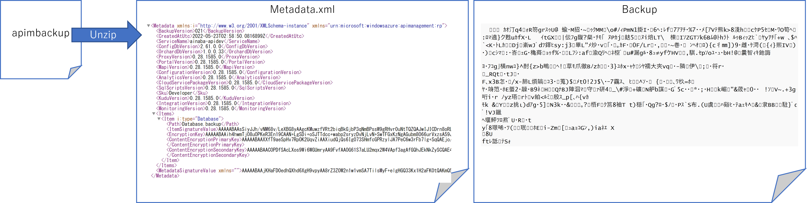
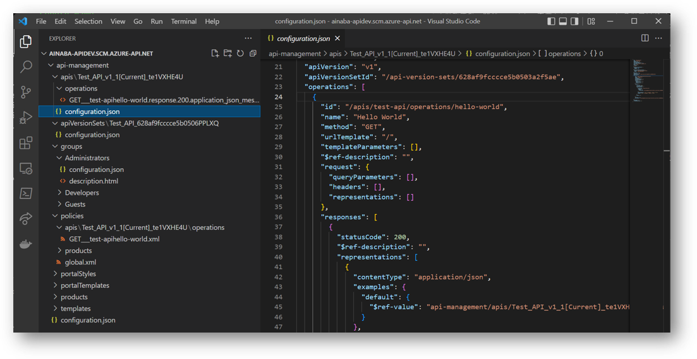
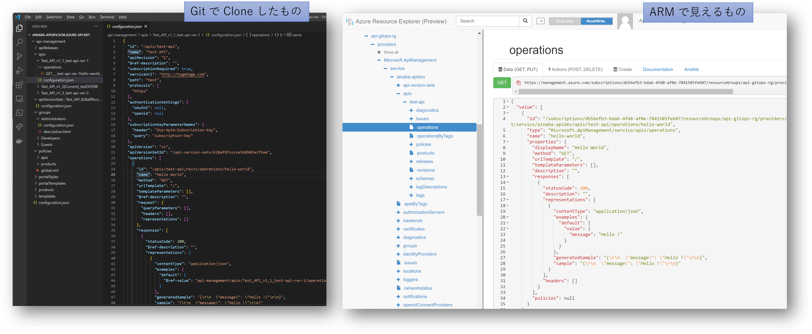
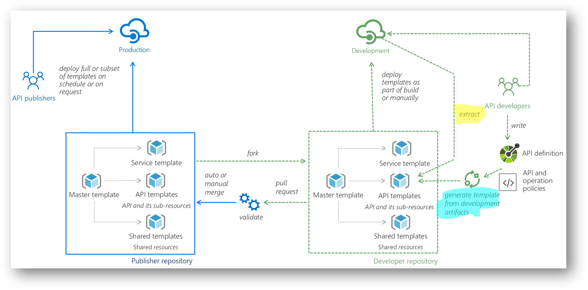

# Azure API Management の CI/CD にまつわる基礎知識

具体的に [API Management DevOps Resource Kit](https://github.com/Azure/azure-api-management-devops-resource-kit) を試す前段階として、いくつか情報を整理しておきたいと思います。
要は以下の２つが両立できれば良いわけですから、何も DevOps Resource Kit に拘る必要はありません。

- 好き放題に壊しても構わない開発環境で生産性を高める
- 開発環境の成果を本番環境に対して安全に適用する

しかし結論としては API Management の標準機能では難しく、Resource Kit の助けが必要だと考えます。

## 開発環境の Backup と本番環境への Resotre で出来ないか？

API Management には[バックアップとリストア](https://docs.microsoft.com/ja-jp/azure/api-management/api-management-howto-disaster-recovery-backup-restore) の機能もあります。
開発環境で出来上がった設定内容をバックアップして、それを本番環境に適用してもよいわけです。
なぜかドキュメントでは OAuth 2.0 のアクセストークンをとって REST API をゴリゴリたたいていくアプローチですが、
ちゃんと以下の様なコマンドも用意されています。

- [Backup-AzApiManagement](https://docs.microsoft.com/en-us/powershell/module/az.apimanagement/backup-azapimanagement)
- [Restore-AzApiManagement](https://docs.microsoft.com/en-us/powershell/module/az.apimanagement/restore-azapimanagement)

開発環境の API Management で設定した情報をストレージアカウントにバックアップして、そこに保存されたファイルをテストや本番環境などにリストアすれば良いわけです。
実際に作ってみた [スクリプト](./ops-apim.ps1) を置いておきました。
バックアップもリストアもせいぜい数行で済むレベルなので、それほど難しくもありません。
しかしこれだけだと開発を進めていく上ではいくつか難点があると思います。

### 開発環境でのうっかりミスは本番環境にも反映される

まずは当たり前といえば当たり前なのですが「開発環境でのうっかりミスまで本番環境に反映されてしまう」ことでしょうか。
新し
そもそもこのうっかりミスで本番障害を起こさないために CI/CD したいわけですから、あまり改善になっていません。
もちろん通常はテスト環境などにデプロイして「テストが通ったら本番環境に適用」というプロセスがあると思いますので、実害は無いのかもしれませんが。

### 差分の比較が出来ない

実際にバックアップを取ってみたファイル（既定では apibackup という拡張子で実態は zip ファイル）を解凍してみると、２つのファイルが出てきます。
片方はメタデータの XML で、もう１つはバイナリファイルでした。
後者のフォーマットが分かればどうにかなるかもしれませんが、複雑な API 定義やポリシーをブラックボックス的に扱うのはやはり不安です。



### 部分的な展開が出来ない

バックアップは対象の API Management に含まれる「全ての API の全てのバージョンやリビジョンや設定項目など」ほぼ全てが対象になります。
API Management には担当部署も背景もライフサイクルも異なる様々な API が混在する可能性があるわけです。
ある 1 つの API の機能改善のために全てをリストアするのは乱暴だと思いますし、開発環境の API Management も１つしか持てないことになるので、生産性の観点からもナンセンスです。
特定の API のリビジョンだけを単体でデプロイできる必要があるかと思います。

### 環境固有のパラメタが切り離せない

また [バックアップとリストアのドキュメント](https://docs.microsoft.com/ja-jp/azure/api-management/api-management-howto-disaster-recovery-backup-restore)
にも記載があるのですが、開発・テスト・本番といったステージングのプロセスを進めるうえでは下記が致命的だと思います。

> また、バックアップおよび復元操作は、開発やステージングなど、運用環境間の API Management サービス構成のレプリケートで使用できます.
ユーザーやサブスクリプションなどのランタイム データも同様にコピーされ、望ましくない場合もあることに注意してください。

開発用に使っているサブスクリプションキーを使用して本番環境の API を呼び出せるとか大問題ですよね。

### バックアップ・リストア「いらない子」ではない

いろいろと問題点をあげつらってしまいましたが、バックアップとリストアの機能は無駄ではありません。
上記のドキュメントにあるように災害対策の様な「独立したクローン」を複数持ちたい場合に使用するのはもちろん、
開発環境を壊したときに元に戻すとか、テスト環境で本番リリースがＮＧになった時に戻すといったような、各環境の保全の機能として利用してください。
（そもそもバックアップ・リストアってそのための機能ですし）


## Git Repository が使えるのでは？

API Management には [Git を使用した構成管理](https://docs.microsoft.com/ja-jp/azure/api-management/api-management-configuration-repository-git) の機能が提供されています。
Git なら差分も取れますし前述のバックアップ・リストアよりもホワイトボックスに扱えそうですよね。

が、こちらも実は問題がありました。
ローカルに git clone したディレクトリ構造を開いて見たのが下図になるのですが、良くわからない参照 ID のようなモノがそこら中にちりばめられています。
正直どこを修正すれば何ができるのか全く分からず、数分で心が折れました。
一応上記のドキュメントに内容の解説もついてはいるのですが。



フォーマットが難解であっても Open API Specification のような一般的に普及しているものならともかく、こういった API Management 固有の文学を理解しつつ開発を進めるのは至難の業なんじゃないでしょうか。
少なくとも Azure Portal でポチポチやってきた人間には敷居が高すぎます。

### 履歴管理としては利用できる？

開発作業自体は Azure Portal でやるとして、その変更履歴として Git を利用するという手も考えられます。
Azure Portal で API Management を開いてリポジトリメニューから「リポジトリに保存する」を押すたびにコミットが作られるようです。
まあこの時点で「保守のタスクとコミットが紐つかないのでは？」疑惑が拭えませんが、改めて内容を git pull してみると、
前回「リポジトリに保存する」を押した以降の差分が取れることが分かります。

ただまあ、もともとの構造とドキュメントが難解だと差分が取れたところで・・・

### （参考）API リビジョンを１つ上げてオペレーションを１つ追加したときの diff

```git
$ git pull

remote: Enumerating objects: 25, done.
remote: Counting objects: 100% (25/25), done.
remote: Compressing objects: 100% (14/14), done.
remote: Total 18 (delta 3), reused 1 (delta 0), pack-reused 0
Unpacking objects: 100% (18/18), 3.10 KiB | 23.00 KiB/s, done.
From https://ainaba-apidev.scm.azure-api.net
   ef3398b..ff136c3  master     -> origin/master
Updating ef3398b..ff136c3
Fast-forward
 .../configuration.json                             | 94 ++++++++++++++++++++++
 ...200.application_json_message-Hello.default.html |  3 +
 ...00.application_json_Status-Succeed.default.html |  3 +
 api-management/configuration.json                  |  2 +-
 .../operations/GET___test-api-rev-3hello-world.xml | 27 +++++++
 api-management/products/Starter/configuration.json |  3 +-
 6 files changed, 130 insertions(+), 2 deletions(-)
 create mode 100644 api-management/apis/Test_API_v1_3_test-api-rev-3/configuration.json
 create mode 100644 api-management/apis/Test_API_v1_3_test-api-rev-3/operations/GET___test-api-rev-3hello-world.response.200.application_json_message-Hello.default.html
 create mode 100644 api-management/apis/Test_API_v1_3_test-api-rev-3/operations/POST__new_test-api-rev-3n1VPFRKQ.response.200.application_json_Status-Succeed.default.html
 create mode 100644 api-management/policies/apis/Test_API_v1_3_test-api-rev-3/operations/GET___test-api-rev-3hello-world.xml
```

リビジョンを１つ追加してオペレーションも１つ追加しただけなんですけど、割と変更が発生してますね？
気を取り直してコミット履歴を確認してみましょう。

```bash
$ git log

commit ff136c3cd45c038cb21c3ffbf6672f3eac6906c1 (HEAD -> master, origin/master, origin/HEAD)
Author: xxxx@live.com <apimgmt-noreply@mail.windowsazure.com>
Date:   Mon May 23 08:01:36 2022 +0000

    User-initiated snapshot:ふが

commit ef3398bb380207bd179eab23e7be4fdbab25e708
Author: xxxx@live.com <apimgmt-noreply@mail.windowsazure.com>
Date:   Mon May 23 07:53:12 2022 +0000

    User-initiated snapshot:ほげ

commit 2bd7ca5e3ae9fa0a604d072751a4298a19380696
Author: xxxx@live.com <apimgmt-noreply@mail.windowsazure.com>
Date:   Mon May 23 07:34:56 2022 +0000

    User-initiated snapshot:enable repository feature

```

上記で ```User-initiated snapshot``` となっているところが、「リポジトリに保存する」を押したときに入力したコメントになってます。
Azure Portal で開発作業してたら絶対 Commit しない気しかしません。
さて diff をとってみましょう。

```git
$ git diff ef33 ff13

diff --git a/api-management/apis/Test_API_v1_3_test-api-rev-3/configuration.json b/api-management/apis/Test_API_v1_3_test-api-rev-3/configuration.json
new file mode 100644
index 0000000..bf5e20d
--- /dev/null
+++ b/api-management/apis/Test_API_v1_3_test-api-rev-3/configuration.json
@@ -0,0 +1,94 @@
+{
+  "id": "/apis/test-api",
+  "name": "Test API",
+  "apiRevision": "3",
+  "$ref-description": "",
+  "subscriptionRequired": true,
+  "serviceUrl": "http://hogehoge.com",
+  "path": "test",
+  "protocols": [
+    "https"
+  ],

（以降は割愛）
```

### 別環境にデプロイ出来ない

さらに、もう１つの難点として API Management の Git Repository から出力した内容を、他の API Management にデプロイする方法がありません。
より厳密にはドキュメント上に記載がないので、そもそも出来るのかどうかすら分かりません。
ここは深堀するのを諦めました。


## Azure Resource Manager が使えるのでは？

バックアップ・リストアの方法でも Git Repository の方法でも同じなのですが。そもそも API Management インスタンスそのものは別途作られていることが前提です。
いうなれば Azure Resource Manager レベルで管理されている内容、例えばネットワーク構成とか SKU とかは出力できていません。
まあそちらは ARM テンプレートで管理すれば良いという話ではあります。

ところで [Azure Resource Explorer](https://resources.azure.com)
を使って API Management の内容を確認してみると、実は API Management のサービス部分だけではなく、API やそのオペレーションの定義なども ARM でリソースとして管理されていることがわかります。
API Management は他の Azure リソースと同様に ARM テンプレートを使用した IaC が出来るわけですから、 API 定義も一緒に管理してしまえば良いのでは？
となるわけです。

### 構造が難解なのは変わらないのでは？

さきほどローカル Git リポジトリに Clone したものと、Azure Resource Explorer での表示を比較してみたのが下の図です。



ARM テンプレートによる API の定義が難解ではないとかは口が裂けても言えませんが、少なくとも API Management の Git リポジトリよりは経験者が多いのではないかと思います。
ただ ARM で管理されているということは[ちゃんとリファレンスがあります](https://docs.microsoft.com/ja-jp/azure/templates/microsoft.apimanagement/service)。
もちろん読んで理解できるとしても、保守できるか否かはまた別の話だと思います。

### API Management DevOps Resource Kit が使えそう？

やっと本題に近づいてきましたが、この [API Management DevOps Resource Kit](https://github.com/Azure/azure-api-management-devops-resource-kit) で提供されているのはざっくり言って「API Management の ARM テンプレート管理を支援するためのツール」です。
前述の通り直接 ARM テンプレートを保守するのは敷居が高いですが、この Resource Kit を使用すれば少しは楽になることが期待できます。
具体的には下図のハイライト部分です。



Resource Kit のカバー範囲が割と狭いので拍子抜けしてしまいそうなんですが、全体的には ARM Template を使用した IaC と、それを管理する GitOps の世界観であって、API Management に固有の課題は「ARM による API の定義（API Template）をどうやって保守するか？」です。
ここでは２つのアプローチが提示されています。

- Creator 側のルート
    - API developer は任意のツールを使用して Open API Specification 形式で API Definition を作成する
    - （オプション）API や Operation に適用される policy を定義する
    - Resource Kit に含まれる Creator を使用して API Template を生成する
    - 開発環境の API Management にデプロイしてテストする
- Extractor 側のルート
    - API developer は Azure Portal 等を使用して API Management そのものを保守しつつテストもする
    - Extractor を使用して API Template を生成する

個人的には Extractor 側のルートが好みです。
世間的には Azure Portal でポチポチ API を定義するよりも Open API Specification に慣れ親しんだ人の方が多いでしょう。
しかし [Open API Specification のインポートは Azure Portal でも可能](https://docs.microsoft.com/ja-jp/azure/api-management/import-api-from-oas)ですので、その観点で Creator 側のルートに優位性はないと思います。
となると Policy の作成や監視の構成など API Management 特有の要素に対しては Azure Portal でポチポチしたり、Azure PowerShell や CLI で操作したほうが楽が出来るかと思います。
そしてなによりも本物の API Management を使用して開発と動作テストがシームレスに行えることが一番のメリットだと考えます。
Creator 側のルートは本物の API Management が無くても開発作業ができる、という見方も出来なくはないのですが、頻繁にデプロイ出来ない（しにくい）から開発速度が上がらないデメリットの方が勝るのではないかと思います。

### 定まったお作法はない

Extractor も Creator も .NET 6 で作られた単なるコマンドラインツールなので、それ以外は Resource Kit 的にはオプションと考えてよいと思います。
図のようにオリジナルから fork した別リポジトリで開発して Pull Request を出しても良いですし、単一リポジトリでブランチ管理してもシンプルで良いように思います。
CI/CD パイプラインもサンプルには Azure DevOps が採用されていますが、PowerShell などでスクリプト化して手元で実行しても良いですし、GitHub Actions でもできるはず。


## 前置き終わり

前置きがやたら長いのですが、要点は以下だと考えます。

- 一般的な（ドキュメントが充実している）API の開発には Azure Portal 等の標準ツールを使う
- API Management の設定内容や API の定義は ARM Template として Extractor で出力して Git で管理する
- CI/CD パイプラインの実装や GitOps を実現するフローは使い慣れたものに合わせる
- 開発および本番環境が破損したときに備えてバックアップは取っておく

次は [Power Shell 編](./README-PowerShell.md)です。
