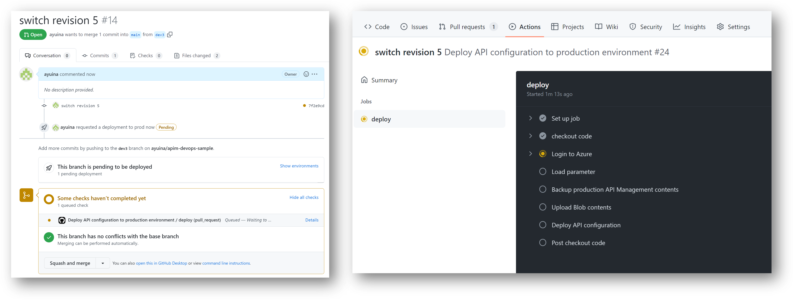

# GitHub Actions を使用した DevOps 編

さて一連の作業の流れが確認出来たので、ここからは Github Actions を使用して自動化していきます。

## ブランチと実行環境の関係

Resource Kit ではリポジトリのフォークを使用した開発フローを想定しているようでしたが、本サンプルでは少し簡単に単一リポジトリ内でのブランチで制御していきたいと思います。


ワークフローとして自動化する内容とイベントを整理していくと以下のようになるでしょうか。

|イベント|開発者の作業|GitHub Actions トリガー|GitHub Actions ワークフロー|
|---|---|---|---|
|開発作業の開始|手動実行|workflow_dispatch|開発環境の API Management のバックアップを行う|
|本番環境へ移送|main ブランチへのプルリクエスト|pull_request|本番環境の API Management のバックアップを行い、対象のリビジョンをデプロイする|
|本番稼働|main ブランチへのマージ|push|本番環境の API Management のリビジョンを切り替える|


## Github Actions から Azure に接続する

前述の様な GitHub Actions ワークフローでは Azure 環境を操作することになりますので、Azure Active Directory に対してサービスプリンシパルとしてログインできる必要があります。
本サンプルではフェデレーション ID 資格情報を使用していますので、以下の設定が必要です。

- Azure Active Directory にアプリケーションを登録する
- 登録したアプリケーションが GitHub Repository を信頼するように設定する
- Azure サブスクリプションに対して必要な権限を持つ共同作成者ロールなどに、登録したアプリケーションを割り当てる
- GitHub Actions Secret に Azure AD テナント、Azure AD アプリケーション、Azure サブスクリプションに ID を登録する


設定方法の詳細は下記をご参照ください。

- [GitHub リポジトリを信頼するようにアプリを構成する (プレビュー)](https://docs.microsoft.com/ja-jp/azure/active-directory/develop/workload-identity-federation)
- [GitHub Actions を使用して Azure に接続する](https://docs.microsoft.com/ja-jp/azure/developer/github/connect-from-azure?tabs=azure-portal%2Clinux)」


## 開発作業の開始

まず忘れないうちに main ブランチから dev ブランチに移動します。

```powershekll
git checkout -b dev
```

Github Actions を使用したワークフローは[こちら](./.github/workflows/backup-apim.yml)にサンプルが置いてあります。
基本的に PowerShell 編で紹介したスクリプトファイルを実行するだけですね。
このワークフローの手動実行時に GitHub Environment を指定できるようになっており、選択した Environment 名を含むパラメータファイルを読み込むようになっています。


このワークフローを実行するためには事前に下記の設定が必要です。

- GitHub Environment （```dev``` および ```prod```）の追加
- Azure AD アプリケーションの信頼するエンティティとして ```dev``` 環境を追加
- API Management に対して必要な権限を持つ共同作成者などのロールを Azure AD アプリケーションを割り当てる

## API の保守

バックアップが終わったら Azure Portal を使うなりして API の Revision を追加し、API の定義を書き換えていく作業になります。
実装が終わったら PowerShell 編と同様に Resource Kit の Extractor を使用して新しい Revision の API Template を出力します。
```powershell
# download resource kit
$reskitVersion = '1.0.0-beta.5'
$reskiturl = "https://github.com/Azure/azure-api-management-devops-resource-kit/releases/download/$($reskitVersion)/reskit-$($reskitVersion).zip"
$zipfile = "reskit.zip"
Invoke-WebRequest -Uri $reskiturl -OutFile $zipfile
# unzip resource kit
Expand-Archive $zipfile
Remove-Item $zipfile

# extract an API definition from api management dev instance
$config = [System.IO.Path]::GetFullPath(".\echo-api-extract.json")
.\reskit\ArmTemplates.exe extract --extractorConfig $config
```
まず古い Revision を編集してしまっていないかなど、予期しない編集などが発生しないように確認してください。
また 出力した API Revision の isCurrent プロパティが true になっていないことを確認します。

```json
    {
      "apiVersion": "2021-08-01",
      "type": "Microsoft.ApiManagement/service/apis",
      "name": "[concat(parameters('apimServiceName'), '/echo-api;rev=5')]",
      "dependsOn": [],
      "properties": {
        "authenticationSettings": {
          "subscriptionKeyRequired": false
        },
        "subscriptionKeyParameterNames": {
          "header": "Ocp-Apim-Subscription-Key",
          "query": "subscription-key"
        },
        "apiRevision": "5",
        "apiRevisionDescription": "Full CICD Revision",
        "subscriptionRequired": true,
        "displayName": "Echo API",
        "serviceUrl": "http://echoapi.cloudapp.net/api",
        "path": "echo",
        "protocols": [
          "https"
        ]
      }
    },
```

Extractor による出力内容を確認したら、パラメータファイル（[echo-api-armdeploy.prod.parameters.json](./echo-api-armdeploy.prod.parameters.json)）の targetApiRevision パラメータを上記で追加した Revision 番号に書き換えます。
この後の Workflow はこの targetApiRevison を元にデプロイが行われますので、ここが書き換わっていないと本番環境にデプロイした API Revision を上書きすることになってしまいます。

この処理も Github Actions で自動化していくことも可能だと思いますが、本サンプルでは紹介していない Resource Kit の Creator の機能も併用したい場合は作業手順が変わってくると思いますので、ここは ~~サボっています~~ あえて手動実行にしています。

## 本番環境へ移送

Github Actions を使用したワークフローは[こちら](./.github/workflows/deploy-api-production.yml)にサンプルが置いてあります。
内容的には PowerShell 編で紹介したスクリプトの内容を YAML の中にインラインスクリプトで実装しているだけです。
PowerShell の操作のようにインタラクティブな制御はできないので、ARM テンプレートパラメータファイルに記載されている構成情報を元に動作するように実装しています。

こちらは Pull Request をトリガーとしたワークフローとなっており、API 開発者がデプロイしたい API Revision の ARM Template およびパラメタファイルをを Commit し、main ブランチに Pull Request を生成することで、本番環境への移送を申請したことを表します。

```powershell
git add .
git commit -m "add new revision and change target api revision"
git push --setup-upstream origin dev
```

main ブランチへ Pull Request を作成すると、下記のようにワークフローが動きます。



ワークフローが正常に完了すると、新しい Revision （ただし Current ではない）が追加されているはずです。


なおここでは Revision を切り替えていないとはいえ、いきなり本番環境へのデプロイを動かしてしまっていますが、Test や Staging などの別環境へのデプロイをクッションにするのも良いと思います。
また Github Actions Environment で Reviewer を設定して、本番環境への移送が発生する前に承認プロセスを挟むのも良いでしょう。

## 本番稼働

追加された Revision の動作を確認し、これを本番化して良いのであれば、Pull Request を main ブランチへマージします。
このためここの処理のワークフローは main ブランチへの push トリガーで起動します。
サンプルは [switch-api-revision.yml](./.github/workflows/switch-api-revision.yml) になります。

