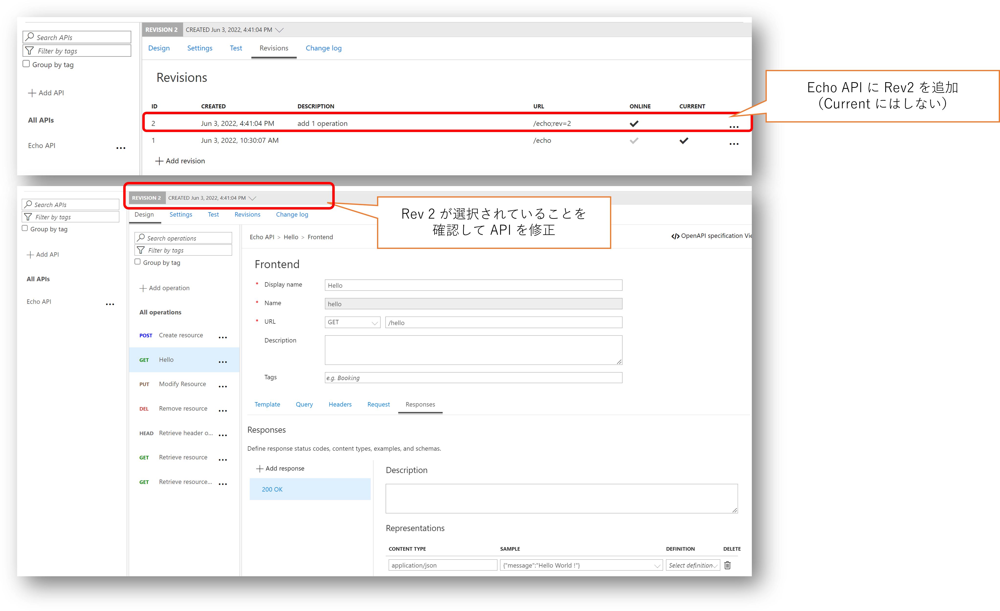

# API Management DevOps サンプル

[Azure API Management DevOps resource kit](https://github.com/Azure/azure-api-management-devops-resource-kit) を使用した GitHub DevOps サンプルです。

# Azure PowerShell 編

最終的には GitHub Actions を使用した自動化を目指しますが、まずはサンプルの解説も兼ねてスクリプトで一連の流れを解説していきます。

## 開発作業の進め方

このレポジトリをフォークしたら、以降は ```dev``` ブランチで作業を行います。

```powershell
git checkout dev
```

### 開発環境の準備

まずは開発作業用の API Management を準備します。
ここでは ARM Template([armdeploy.dev.json](./armdeploy.dev.json)) を使用して、API Management と構成のバックアップ用の Storage Account を構築しています。
API Management や Storage Account はユニークな名前が必要になりますのでパラメータファイル（[armdeploy.dev.parameters.json](./armdeploy.dev.parameters.json)）は書き換えて使ってください。

```powershell
$location = 'japaneast'
$devrg = 'apim-dev-rg'

New-AzResourceGroup -Name $devrg -Location $location
New-AzResourceGroupDeployment -Name "apim-devenv" -ResourceGroupName $devrg -TemplateFile ./armdeploy.dev.json `
    -TemplateParameterFile ./armdeploy.dev.parameters.json
```

### API のバックアップ

実際に API の構成などを始める前に、一度バックアップを取っておきます。
パラメータは先の ARM テンプレートデプロイに使用したバラメータファイルに記載されているはずなので、そちらから取ってきます。、

```powershell
$devparam = Get-Content ./armdeploy.dev.parameters.json | ConvertFrom-Json 
$devStrAccName = $devparam.parameters.storageAccountName.value
$bakContainer = $devparam.parameters.backupContainerName.value
$devApimName = $devparam.parameters.apimServiceName.value

.\ops-apim.ps1 -backup -storageAccountName $devStrAccName -containerName $bakContainer -sourceapim $devApimName
```

これ以降も API の作成や編集作業を勧める中で適宜バックアップを取っておくことをお勧めします。

### API の構成

API Management が出来上がると Echo API も作られているはずです。
このままではあまり意味がないので、[こちら](https://docs.microsoft.com/ja-jp/azure/api-management/api-management-get-started-revise-api?tabs=azure-portal) などを参考に Revision 2 を追加し、
Echo API に何らかの機能追加をしておいてください。
Mock 応答を返すなど簡単なもので大丈夫です。



### API 定義の展開 

API Management で管理する API を Azure Portal 等を使用して開発・テストしたら、各 API の設定内容を ARM テンプレートとして展開、ソースコードとして管理できるようにしていきます。

まずはビルド済みのリソースキットをダウンロードして、```reskit``` ディレクトリに展開しておきます。
最新バージョンは[こちら](https://github.com/Azure/azure-api-management-devops-resource-kit/releases)で確認できます。

```powershell
# download resource kit
$reskitVersion = '1.0.0-beta.5'
$reskiturl = "https://github.com/Azure/azure-api-management-devops-resource-kit/releases/download/$($reskitVersion)/reskit-$($reskitVersion).zip"
$zipfile = "reskit.zip"
Invoke-WebRequest -Uri $reskiturl -OutFile $zipfile
# unzip resource kit
Expand-Archive $zipfile
Remove-Item $zipfile
```

次にリソースキットの Extractor を使用して ARM テンプレートを生成するための構成ファイルを作成します。
サンプル（ [extract-echo-api.json](./extract-echo-api.json) ）では API Management 作成時に既定で提供される Echo API を対象にしています。
また展開した ARM テンプレートは API 単位でディレクトリを分け、さらにリビジョンごとにサブディレクトリを分ける構成にしています。

なお Extractor 構成ファイルでは resourceGroup, sourceApimName, fileFolder, apiName 以外は実際の値でなくても構いません。
出力した ARM テンプレートを展開することになる、テスト環境や本番環境の API Management および一時的にファイルを配置するための Storage Account および SAS キーはまだ決まっていませんし、これらの値は実際に ARM Template をデプロイする際のパラメタとして指定することが可能です。
ただし Extract する段階で何らかの値を指定しておかないと現在の開発環境の値で ARM Template 内にハードコードされてしまうため、ダミーの値でも良いので指定しておく必要があります。
Extractor 構成ファイルの詳細は[こちら](https://github.com/Azure/azure-api-management-devops-resource-kit/tree/main/src#extractor)を参照してください。

```powershell
# extract an API definition from api management dev instance
$config = [System.IO.Path]::GetFullPath(".\extract-echo-api.json")
.\reskit\ArmTemplates.exe extract --extractorConfig $config
# or override command line parameter
.\reskit\ArmTemplates.exe extract --extractorConfig $config --sourceApimName $devApimName --resourceGroup $devrg
```

出力イメージは以下のようになります。

```bash
./
    api-name/
        api-name;rev=1/
            policies/
                *.xml
            *.template.json
        api-name;rev=2/
            policies/
                *.xml
            *.template.json
        ...
```

## 本番環境への展開

それでは出力した API の定義を含んだ ARM Template を本番環境にデプロイしていきます。

### マスターテンプレートの作成

Extractor が出力した各 API リビジョンのマスターテンプレート ```baseFilename-master.template.json``` には API Management そのものの定義が含まれていません。
また API Management 以外のサービス、例えば ARM テンプレートデプロイ時にはマスターテンプレートからリンクされたテンプレートを保存するためのストレージアカウントなども含まれていません。
Extractor が出力したマスターテンプレートを修正しすると、次に Extractor を実行した際に上書きされてしまうことになるので、これを呼び出すためのさらに上位のマスターテンプレートを作成することにします。
サンプルは [armdeploy.prod.json](./armdeploy.prod.json) を参考にして下さい。

### 本番環境用 API Management と Storage Account の作成

マスターテンプレートが出来上がったら本番環境を構築します。
サンプルのマスターテンプレートでは API Management および Storage Account サービスを定義してありますが、そこからリンクした（Extractor で出力した）API 定義のテンプレートに関しては、構築する API の名前 ```targetApiName``` やリビジョン ```targetApiRevision``` を指定しなければ動作しないようにしてあります。
まだこの段階では Storage Account を作っていないため、リンクしたテンプレートをアップロードする先がないですし、SAS の生成も出来ないからです。

```powershell
$location = 'japaneast'
$prodrg = 'apim-prod-rg'

New-AzResourceGroup -Name $prodrg -Location $location
New-AzResourceGroupDeployment -Name "apim-prodenv" -ResourceGroupName $prodrg -TemplateFile .\armdeploy.prod.json `
    -TemplateParameterFile .\armdeploy.prod.parameters.json
```

こちらの展開が終わると本番環境の API Management でも Echo API の Revision 1 が出来上がっているはずです。
ここに開発環境で作成した Revision 2 の API をデプロイしていきます。

### デプロイ前のバックアップ

そのまえに本番環境もバックアップをとっておきましょう。

```powershell
$prodparam =  Get-Content .\armdeploy.prod.parameters.json | ConvertFrom-Json
$prodStrAccName = $prodparam.parameters.storageAccountName.value
$bakContainer = $prodparam.parameters.backupContainerName.value
$prodApimName = $prodparam.parameters.apimServiceName.value

.\ops-apim.ps1 -backup -storageAccountName $prodStrAccName -containerName $bakContainer -sourceapim $prodApimName
```

### リンクされたテンプレートのアップロード

Storage Account が出来上がったら、Blob コンテナーを作成して SAS を発行、Extractor で出力しておいたテンプレート一式をアップロードしておきます。
ここでは一回のAPIのデプロイのたびにコンテナを新規に作成することにしています。
こうすることで過去にデプロイした API 定義が後で確認できるようにしています。

```powershell
#Extractor 構成ファイルで指定した値から値を利用
$extractorConfig = (Get-Content $config | ConvertFrom-Json)
$targetApi = $extractorConfig.apiName

$targetRevision = '2'


# create blob container
$strAccKey = (Get-AzStorageAccountKey -ResourceGroupName $prodrg -Name $prodStrAccName)[0].Value
$strctx = New-AzStorageContext -StorageAccountName $prodStrAccName -StorageAccountKey $strAccKey
$containerName = [DateTime]::Now.ToString("yyyyMMdd-HHmmss")
$container = New-AzStorageContainer -Context $strctx -Name $containerName

# upload linked template
$templateRoot = ".\{0}\{0};rev={1}"  -f $targetApi, $targetRevision
Get-ChildItem $templateRoot -Recurse | where {$_ -is [System.IO.FileInfo]} | foreach {
    $blob = [System.IO.Path]::GetRelativePath($templateRoot, $_.Fullname).Replace("\", "/")
    Write-Host ("uploading {0} as {1}" -f $_.Fullname, $blob  )
    Set-AzStorageBlobContent -File $_.Fullname -Container $containerName -Blob $blob -Context $strctx 
}

# generate container sas
[DateTime]$exp = [DateTime]::UtcNow.AddDays(1)
$sastoken = New-AzStorageContainerSASToken -Context $strctx -Name $containerName -Permission racwtl -ExpiryTime $exp
```


### API 定義のデプロイ

もう一度マスターテンプレートをデプロイします。
今度はパラメタファイルに加えて、対象 API の情報やそのテンプレートをアップロードした Blob コンテナの情報を追加しています。

```powershell
$baseFileName = $extractorConfig.baseFileName

New-AzResourceGroupDeployment -Name "api-$($containerName)" -ResourceGroupName $prodrg -TemplateFile .\arm-master.json `
    -TemplateParameterFile .\arm-master.parameters.json `
    -linkedTemplateContainerName $containerName -storageSasToken $sastoken -baseFileName $baseFileName `
    -targetApiName $targetApi -targetApiRevision $targetRevision
```

### #################################################

revision がついてないAPIの修正
isCurrentをfalse に


# GitHub Actions を使用した DevOps 編

Github Actions を使用してバックアップするための[ワークフロー](./.github/workflows/backup-apim.yml)を使用することもできます。
こちらを使用する場合はワークフローが Azure サブスクリプションにアクセスできる必要があります。
サンプルのワークフローでは GitHub リポジトリのワークロード ID フェデレーション（執筆時点ではプレビュー）を使用しています。

- [GitHub リポジトリを信頼するようにアプリを構成する (プレビュー)](https://docs.microsoft.com/ja-jp/azure/active-directory/develop/workload-identity-federation)
- [GitHub Actions を使用して Azure に接続する](https://docs.microsoft.com/ja-jp/azure/developer/github/connect-from-azure?tabs=azure-portal%2Clinux)」
