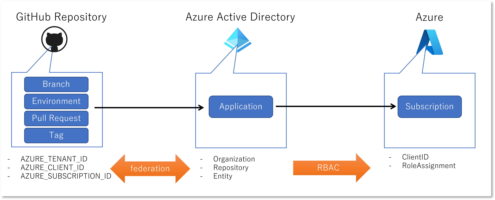
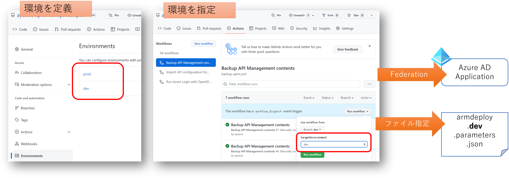

# API Management の DevOps サンプル

[Azure API Management DevOps resource kit](https://github.com/Azure/azure-api-management-devops-resource-kit) を使用した GitHub DevOps サンプルです。

# Azure PowerShell 編

最終的には GitHub Actions を使用した自動化を目指しますが、まずはサンプルの解説も兼ねてスクリプトで一連の流れを解説していきます。

## 開発作業の進め方

このレポジトリをフォークしたら、以降は ```dev``` ブランチで作業を行います。

```powershell
git checkout dev
```

### 開発環境の準備

まずは開発作業用の API Management を準備します。
ここでは ARM Template([armdeploy.dev.json](./armdeploy.dev.json)) を使用して、API Management と構成のバックアップ用の Storage Account を構築しています。
API Management や Storage Account はユニークな名前が必要になりますのでパラメータファイル（[armdeploy.dev.parameters.json](./armdeploy.dev.parameters.json)）は書き換えて使ってください。

```powershell
$location = 'japaneast'
$devrg = 'apim-dev-rg'

New-AzResourceGroup -Name $devrg -Location $location
New-AzResourceGroupDeployment -Name "apim-devenv" -ResourceGroupName $devrg -TemplateFile ./armdeploy.dev.json `
    -TemplateParameterFile ./armdeploy.dev.parameters.json
```

### API のバックアップ

実際に API の構成などを始める前に、一度バックアップを取っておきます。
API Management 用の PowerShell スクリプト（[ops-apim.ps1](./ops-apim.ps1)）もサンプルに追加してありますので内容をご確認ください。
スクリプトに渡すパラメータは先の ARM テンプレートデプロイに使用したバラメータファイルに記載されているはずなので、そちらから取ってきます。

```powershell
$devparam = Get-Content ./armdeploy.dev.parameters.json | ConvertFrom-Json 
$devStrAccName = $devparam.parameters.storageAccountName.value
$bakContainer = $devparam.parameters.backupContainerName.value
$devApimName = $devparam.parameters.apimServiceName.value

.\ops-apim.ps1 -backup -storageAccountName $devStrAccName -containerName $bakContainer -sourceapim $devApimName
```

これ以降も API の作成や編集作業を勧める中で適宜バックアップを取っておくことをお勧めします。

### API の構成

API Management が出来上がると Echo API も作られているはずです。
このままではあまり意味がないので、[こちら](https://docs.microsoft.com/ja-jp/azure/api-management/api-management-get-started-revise-api?tabs=azure-portal) などを参考に Revision 2 を追加し、
Echo API に何らかの機能追加をしておいてください。
Mock 応答を返すなど簡単なもので大丈夫です。


### API 定義の展開 

API Management で管理する API を Azure Portal 等を使用して開発・テストしたら、各 API の設定内容を ARM テンプレートとして展開、ソースコードとして管理できるようにしていきます。

まずはビルド済みのリソースキットをダウンロードして、```reskit``` ディレクトリに展開しておきます。
最新バージョンは[こちら](https://github.com/Azure/azure-api-management-devops-resource-kit/releases)で確認できます。

```powershell
# download resource kit
$reskitVersion = '1.0.0-beta.5'
$reskiturl = "https://github.com/Azure/azure-api-management-devops-resource-kit/releases/download/$($reskitVersion)/reskit-$($reskitVersion).zip"
$zipfile = "reskit.zip"
Invoke-WebRequest -Uri $reskiturl -OutFile $zipfile
# unzip resource kit
Expand-Archive $zipfile
Remove-Item $zipfile
```

次にリソースキットの Extractor を使用して ARM テンプレートを生成するための構成ファイルを作成します。
サンプル（ [extract-echo-api.json](./extract-echo-api.json) ）では API Management 作成時に既定で提供される Echo API を対象にしています。
また展開した ARM テンプレートは API 単位でディレクトリを分け、さらにリビジョンごとにサブディレクトリを分ける構成にしています。

なお Extractor 構成ファイルでは resourceGroup, sourceApimName, fileFolder, apiName 以外は実際の値でなくても構いません。
出力した ARM テンプレートを展開することになる、テスト環境や本番環境の API Management および一時的にファイルを配置するための Storage Account および SAS キーはまだ決まっていませんし、これらの値は実際に ARM Template をデプロイする際のパラメタとして指定することが可能です。
ただし Extract する段階で何らかの値を指定しておかないと現在の開発環境の値で ARM Template 内にハードコードされてしまうため、ダミーの値でも良いので指定しておく必要があります。
Extractor 構成ファイルの詳細は[こちら](https://github.com/Azure/azure-api-management-devops-resource-kit/tree/main/src#extractor)を参照してください。

```powershell
# extract an API definition from api management dev instance
$config = [System.IO.Path]::GetFullPath(".\extract-echo-api.json")
.\reskit\ArmTemplates.exe extract --extractorConfig $config
# or override command line parameter
.\reskit\ArmTemplates.exe extract --extractorConfig $config --sourceApimName $devApimName --resourceGroup $devrg
```

出力イメージは以下のようになります。

```bash
./
    api-name/
        api-name;rev=1/
            policies/
                *.xml
            *.template.json
        api-name;rev=2/
            policies/
                *.xml
            *.template.json
        ...
```

Hello API の場合 Revision 1 は API Management 生成時に自動生成されたものであるため、本番環境には追加した Revision 2 をデプロイすることになります。
先ほどの例のように Hello Operation を追加したとすると、Revision 1 と 2 のディレクトリに含まれる ```basefilename-echo-api;rev=N-api.template.json``` というファイルを比較すると、以下の様な Azure リソースが確認できます（内容は抜粋したもの）。

```json
  "resources": [
    // API の名前と apiRevision プロパティが 2 に設定されている
    {
      "apiVersion": "2021-08-01",
      "type": "Microsoft.ApiManagement/service/apis",
      "name": "[concat(parameters('apimServiceName'), '/echo-api;rev=2')]",
      "dependsOn": [],
      "properties": {
        "authenticationSettings": {
          "subscriptionKeyRequired": false
        },
        "subscriptionKeyParameterNames": {
          "header": "Ocp-Apim-Subscription-Key",
          "query": "subscription-key"
        },
        "apiRevision": "2",
        "apiRevisionDescription": "add 1 operation",
        "subscriptionRequired": true,
        "displayName": "Echo API",
        "serviceUrl": "http://echoapi.cloudapp.net/api",
        "path": "echo",
        "protocols": [
          "https"
        ]
      }
    },
    // Echo API のサブリソースとして Hello Operation が作成されている
    {
      "apiVersion": "2021-08-01",
      "type": "Microsoft.ApiManagement/service/apis/operations",
      "name": "[concat(parameters('apimServiceName'), '/echo-api;rev=2/hello')]",
      "dependsOn": [
        "[resourceId('Microsoft.ApiManagement/service/apis', parameters('apimServiceName'), 'echo-api;rev=2')]"
      ],
      "properties": {
        "displayName": "Hello",
        "method": "GET",
        "urlTemplate": "/hello",
        "description": "",
        "templateParameters": [],
        "responses": [
          {
            "description": "",
            "headers": [],
            "representations": [
              {
                "contentType": "application/json",
                "examples": {
                  "default": {
                    "value": {
                      "message": "Hello World !"
                    }
                  }
                }
              }
            ],
            "statusCode": 200
          }
        ]
      }
    },
    // Hello Operation のサブリソースとしてポリシー参照が設定されている
    {
      "apiVersion": "2021-08-01",
      "type": "Microsoft.ApiManagement/service/apis/operations/policies",
      "name": "[concat(parameters('apimServiceName'), '/echo-api;rev=2/hello/policy')]",
      "dependsOn": [
        "[resourceId('Microsoft.ApiManagement/service/apis/operations', parameters('apimServiceName'), 'echo-api;rev=2', 'hello')]"
      ],
      "properties": {
        "value": "[concat(parameters('policyXMLBaseUrl'), 'echo-api;rev=2-hello-operationPolicy.xml', parameters('policyXMLSasToken'))]",
        "format": "rawxml-link"
      }
    },
```

上記で参照されているポリシーファイル（policies ディレクトリ）を確認すると以下のようになっています。

```xml
<policies>
  <inbound>
    <base />
    <mock-response status-code="200" content-type="application/json" />
  </inbound>
  <backend>
    <base />
  </backend>
  <outbound>
    <base />
  </outbound>
  <on-error>
    <base />
  </on-error>
</policies>
```


## 本番環境への展開

それでは出力した API の定義を含んだ ARM Template を本番環境にデプロイしていきます。

### マスターテンプレートの作成

Extractor が出力した各 API リビジョンのマスターテンプレート ```baseFilename-master.template.json``` には API Management そのものの定義が含まれていません。
また API Management 以外のサービス、例えば ARM テンプレートデプロイ時にはマスターテンプレートからリンクされたテンプレートを保存するためのストレージアカウントなども含まれていません。
Extractor が出力したマスターテンプレートを修正しすると、次に Extractor を実行した際に上書きされてしまうことになるので、これを呼び出すためのさらに上位のマスターテンプレートおよびテンプレートパラメータのファイルを作成することにします。
このため Extractor が生成したテンプレートパラメータファイルは使用しません。


サンプルは [armdeploy.prod.json](./armdeploy.prod.json) および [armdeploy.prod.parameters.json](./armdeploy.prod.parameters.json) を参考にして下さい。

### 本番環境用 API Management と Storage Account の作成

マスターテンプレートが出来上がったら本番環境を構築します。
なおサンプルのマスターテンプレートでは API Management および Storage Account サービスを定義してありますが、そこからリンクした（Extractor で出力した）API 定義のテンプレートに関しては、構築する API の名前 ```targetApiName``` やリビジョン ```targetApiRevision``` を指定しなければ動作しないようにしてあります。
この段階ではまだ Storage Account を作っていないため、リンクしたテンプレートをアップロードする先がないですし、SAS の生成も出来ないからです。

```powershell
$location = 'japaneast'
$prodrg = 'apim-prod-rg'

New-AzResourceGroup -Name $prodrg -Location $location
New-AzResourceGroupDeployment -Name "apim-prodenv" -ResourceGroupName $prodrg -TemplateFile .\armdeploy.prod.json `
    -TemplateParameterFile .\armdeploy.prod.parameters.json
```

こちらの展開が終わると本番環境の API Management でも Echo API の Revision 1 が出来上がっているはずです。
ここに開発環境で作成した Revision 2 の API をデプロイしていきます。

### デプロイ前のバックアップ

API をデプロイする前にその前に本番環境 API Management も一度バックアップをとっておきましょう。

```powershell
$prodparam =  Get-Content .\armdeploy.prod.parameters.json | ConvertFrom-Json
$prodStrAccName = $prodparam.parameters.storageAccountName.value
$bakContainer = $prodparam.parameters.backupContainerName.value
$prodApimName = $prodparam.parameters.apimServiceName.value

.\ops-apim.ps1 -backup -storageAccountName $prodStrAccName -containerName $bakContainer -sourceapim $prodApimName
```

### リンクされたテンプレートのアップロード

Storage Account が出来上がったら、Blob コンテナーを作成して SAS を発行、Extractor で出力しておいたテンプレート一式をアップロードしておきます。
ここでは一回の API のデプロイのたびにコンテナを新規に作成することにしています。
こうすることで過去にデプロイした API 定義が後で確認できるようにしています。

```powershell
#Extractor 構成ファイルで指定した値から値を利用
$extractorConfig = (Get-Content $config | ConvertFrom-Json)
$targetApi = $extractorConfig.apiName

$targetRevision = '2'

# create blob container
$strAccKey = (Get-AzStorageAccountKey -ResourceGroupName $prodrg -Name $prodStrAccName)[0].Value
$strctx = New-AzStorageContext -StorageAccountName $prodStrAccName -StorageAccountKey $strAccKey
$containerName = [DateTime]::Now.ToString("yyyyMMdd-HHmmss")
$container = New-AzStorageContainer -Context $strctx -Name $containerName

# upload linked template
$templateRoot = ".\{0}\{0};rev={1}"  -f $targetApi, $targetRevision
Get-ChildItem $templateRoot -Recurse | where {$_ -is [System.IO.FileInfo]} | foreach {
    $blob = [System.IO.Path]::GetRelativePath($templateRoot, $_.Fullname).Replace("\", "/")
    Write-Host ("uploading {0} as {1}" -f $_.Fullname, $blob  )
    Set-AzStorageBlobContent -File $_.Fullname -Container $containerName -Blob $blob -Context $strctx 
}

# generate container sas
[DateTime]$exp = [DateTime]::UtcNow.AddDays(1)
$sastoken = New-AzStorageContainerSASToken -Context $strctx -Name $containerName -Permission racwtl -ExpiryTime $exp
```


### API 定義のデプロイ

もう一度マスターテンプレートをデプロイします。
今度はパラメタファイルに加えて、対象 API の情報やそのテンプレートをアップロードした Blob コンテナの情報を追加しています。

```powershell
$baseFileName = $extractorConfig.baseFileName

New-AzResourceGroupDeployment -Name "api-$($containerName)" -ResourceGroupName $prodrg -TemplateFile .\armdeploy.prod.json `
    -TemplateParameterFile .\armdeploy.prod.parameters.json `
    -linkedTemplateContainerName $containerName -storageSasToken $sastoken -baseFileName $baseFileName `
    -targetApiName $targetApi -targetApiRevision $targetRevision
```

デプロイが完了したら Azure Portal で本番環境の API Management を参照すると、Echo API に Revision 2 が追加され Hello Operation が作成されているはずです。
最後の動作確認をして問題なければ、現在の Revision を 2 に設定すれば本番環境への反映が完成します。


これで一連の作業の流れが確認できました。
初回の API Management 作成作業が終わっていますので、以降は以下の手順で API の開発とデプロイを行うことになります。

- 開発環境
    - 作業開始前に API Management をバックアップ
    - 新しい Revision を作成して API を編集
    - Resource Kit の Extractor を使用して ARM テンプレートを出力
- 本番環境
    - 作業開始前に API Management をバックアップ
    - ARM テンプレートをデプロイ
    - 動作確認をして正常なら Revision を切り替え

### 補足：Revsision の切り替え

ARM テンプレートを使用して API をデプロイする場合、Current Revision を変更することができません。
例えばこのケースでは本番環境で Echo API は Current Revision が "1" になっているのですが、Revision 2 の Echo
 API を isCurrent = true としてデプロイするとエラーが発生します。
このため前述のように API をデプロイした後に手動で Revision の切り替えを行っています。
とはいえ本番環境でいきなり Revision が切り替わると予期せぬエラーが発生したときに大問題になりますので、
ここでやっているように最終チェック後に切り替えをする手順の方が適切だと考えます。

### 補足：API Management のリストア

開発環境や本番環境で作業している際にうっかり API Management の設定内容を壊してしまうのでやり直したい場合もあるでしょう。
その場合は適宜取っておいたバックアップデータをリストアすれば元の状態に戻せます。
サンプルの（[ops-apim.ps1](./ops-apim.ps1)）にはリストア用の処理も実装してありますので、内容はそちらをご確認ください。
各環境のストレージアカウントには Blob としてバックアップデータが保存されていますので、そのファイル名を使用して以下のようにリストアが可能です。

```powershell
$prodparam =  Get-Content .\armdeploy.prod.parameters.json | ConvertFrom-Json
$prodStrAccName = $prodparam.parameters.storageAccountName.value
$bakContainer = $prodparam.parameters.backupContainerName.value
$prodApimName = $prodparam.parameters.apimServiceName.value

.\ops-apim.ps1 -restore -storageAccountName $prodStrAccName -containerName $bakContainer -targetapim $prodApimName `
    -restoreblob 'ayuina-apim-prod_2022-06-03-03-27-07.apimbackup'
```

### 補足 : 指定した API の全 Revision の Extract

上記で説明した内容では Extractor を実行すると、新規に作成した Revision だけでなく全ての Revision の設定内容が出力されます。
これは Extractor の設定としてはこの方式が一番やりやすかったからではありますが、「うっかり旧 Revision を修正してしまった場合にも、Git で差分が確認できる」という副次的なメリットがあります。
ただ、今後 Revision が増えていくと徐々に時間がかかるようになっていきますので、不要になった過去の Revision は削除するなどの工夫をしてください。

# GitHub Actions を使用した DevOps 編

さて一連の作業の流れが確認出来たので、ここからは Github Actions を使用して自動化していきます。
（ここまで作業内容は一度 main ブランチにマージしておいてください。）

## ブランチと環境の相互作用

Resource Kit ではリポジトリのフォークを使用した開発フローを想定しているようでしたが、本サンプルでは少し簡単に単一リポジトリ内でのブランチで制御していきたいと思います。


自動化する内容とイベントを整理していくと以下のようになるでしょうか。

|イベント|GitHub Actionsトリガー|処理内容|補足|
|---|---|---|---|
|開発作業の開始|workflow_dispatch|開発環境の API Management の全 API 設定をバックアップ|作業開始のタイミングで手動実行することにします|
|本番環境への移送|pull_request|本番環境の API Management へ開発した API 設定をデプロイ|開発作業が終わったら main ブランチへ Pull Request を出すこと|
|本番環境で稼働開始|push|デプロイした API の Current Revision を切り替え|テストとレビューの結果、無事に main へマージされたら本番反映する|

### Github Actions から Azure に接続する

GitHub Actions ワークフローから Azure 環境を操作することになりますので、Azure Active Directory に対してサービスプリンシパルとしてログインできる必要があります。
本サンプルではフェデレーション ID 資格情報を使用していますので、以下の設定が必要です。

- Azure Active Directory にアプリケーションを登録する
- 登録したアプリケーションが GitHub Repository を信頼するように設定する
- Azure サブスクリプションに対して必要な権限を持つ共同作成者ロールなどに、登録したアプリケーションを割り当てる
- GitHub Actions Secret に Azure AD テナント、Azure AD アプリケーション、Azure サブスクリプションに ID を登録する



設定方法の詳細は下記をご参照ください。

- [GitHub リポジトリを信頼するようにアプリを構成する (プレビュー)](https://docs.microsoft.com/ja-jp/azure/active-directory/develop/workload-identity-federation)
- [GitHub Actions を使用して Azure に接続する](https://docs.microsoft.com/ja-jp/azure/developer/github/connect-from-azure?tabs=azure-portal%2Clinux)」


### 開発環境の API Management のバックアップ

Github Actions を使用してバックアップするためのワークフローは[こちら](./.github/workflows/backup-apim.yml)にサンプル置いてあります。
こちらを実行するためには下記の設定が必要です。

- GitHub Environment （```dev``` および ```prod``）の追加
- Azure AD アプリケーションの信頼するエンティティとして ```dev``` 環境を追加

ワークフローの手動実行時に GitHub Environment を選択できるようになっており、選択した Environment 名を含むパラメータファイルを読み込むようになっています。

